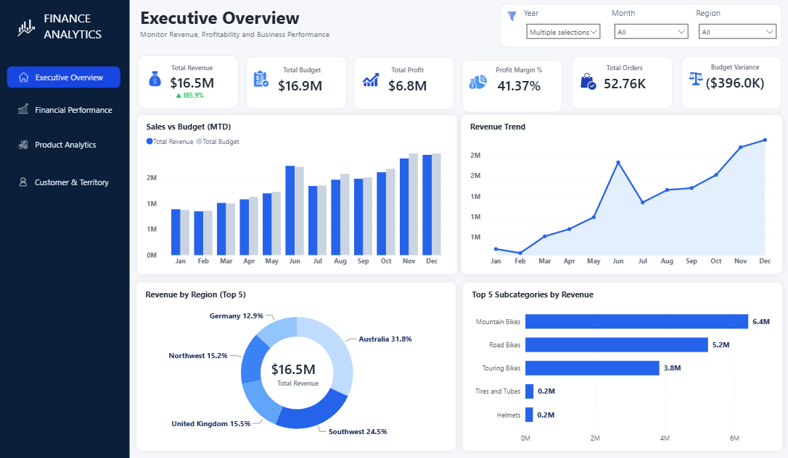
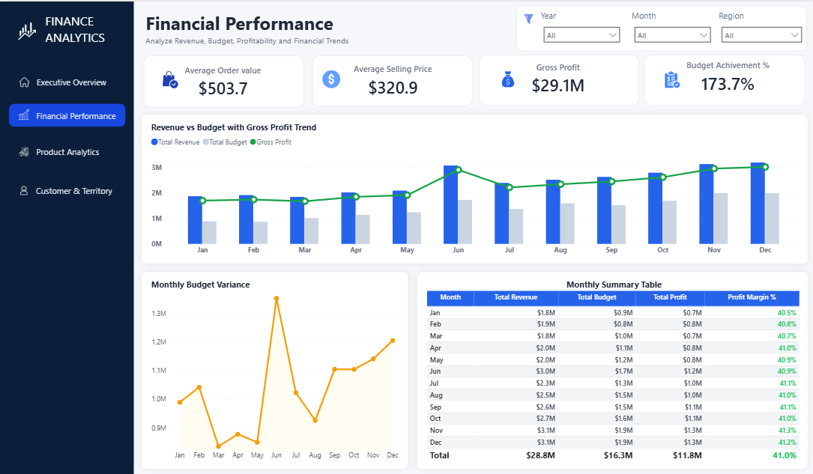
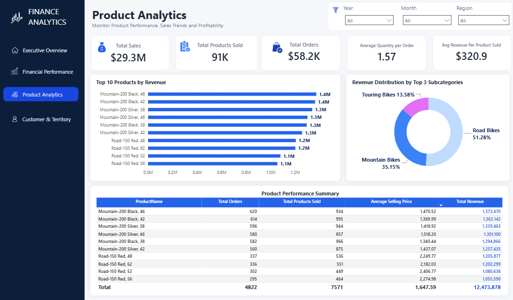
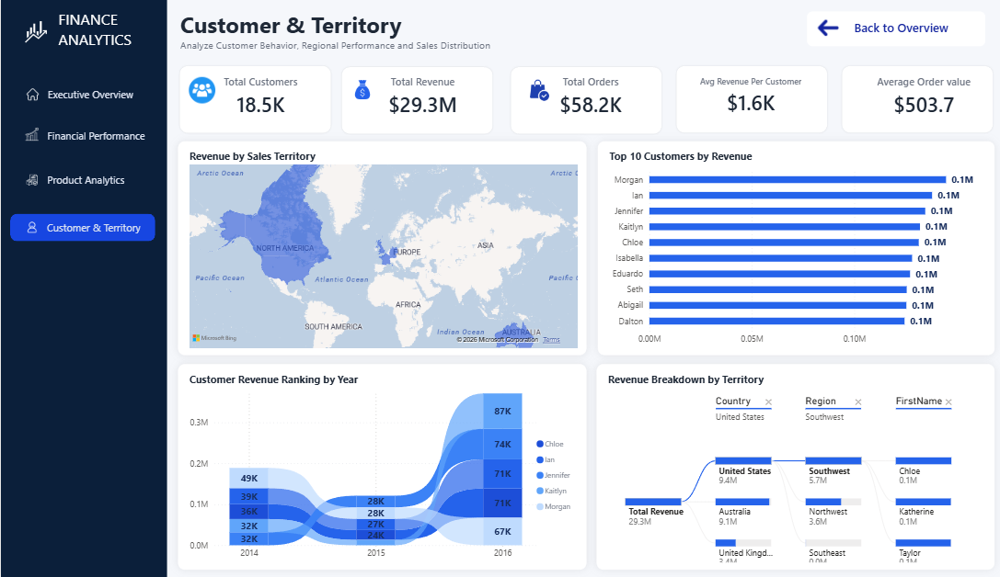

# 📊 Finance Analytics Dashboard

## Power BI Portfolio Project

An interactive Power BI dashboard developed using the **AdventureWorks Sales Dataset** to analyze financial performance, product analytics, customer insights, and sales territory performance through interactive business intelligence reports.

---

# 📌 Project Overview

The **Finance Analytics Dashboard** is an interactive Business Intelligence solution developed using **Microsoft Power BI**.

This project was built using the AdventureWorks Sales Dataset to transform raw business data into meaningful insights and help stakeholders make data-driven decisions.

The dashboard focuses on analyzing key business metrics such as:

- Revenue Performance
- Profit Analysis
- Budget Performance
- Product Performance
- Customer Insights
- Sales Territory Performance

The report follows a clean design approach with a consistent blue color theme, interactive navigation, user-friendly layouts, and advanced Power BI features to enhance the reporting experience.

---

# 🎯 Business Objective

The main objective of this project is to:

- Analyze overall financial performance
- Track revenue and profit trends
- Compare business performance against targets
- Identify top-performing products and categories
- Understand customer purchasing patterns
- Evaluate sales performance across different territories

---

# ✨ Dashboard Features

- Interactive KPI Cards
- Multi-page Dashboard Navigation
- Financial Performance Analysis
- Product Performance Analysis
- Customer & Territory Analysis
- Interactive Filters and Slicers
- Drill-through Analysis
- Report Page Tooltips
- Professional Dashboard Design
- Responsive Visual Layout

---

# 🛠️ Tools & Technologies

## Development Tools

- Microsoft Power BI
- Power Query
- DAX (Data Analysis Expressions)
- Microsoft Excel

## Dataset

- AdventureWorks Sales Dataset

---

# 📄 Dashboard Pages

## 1. Executive Overview

Provides a high-level summary of overall business performance using KPIs and executive-level insights.

**Key Analysis:**
- Revenue Overview
- Profit Performance
- Sales Trends
- Business Growth Metrics

## 2. Financial Performance

Analyzes financial metrics and trends to understand profitability and performance.

**Key Analysis:**
- Revenue Analysis
- Profit Analysis
- Budget vs Actual Performance
- Time-based Financial Trends

## 3. Product Analytics

Evaluates product performance and identifies high-performing products and categories.

**Key Analysis:**
- Product Sales Performance
- Category Analysis
- Top Performing Products

## 4. Customer & Territory Analysis

Analyzes customer behavior and sales distribution across different territories.

**Key Analysis:**
- Customer Insights
- Territory Performance
- Geographic Sales Distribution

---

# 🧮 Data Modeling

The project follows a structured data modeling approach using:

- Fact and Dimension Tables
- Star Schema Design
- Relationship Management
- DAX Measures for Business Calculations

---

# 🖼️ Dashboard Preview

## Executive Overview

## Financial Performance

## Product Analytics

## Customer & Territory Analysis

---

# 📂 Project Folder Structure
Finance-Analytics-Dashboard

├── Assets
├── Dataset
├── Documentation
├── Images
├── PowerBI
└── README.md

---

# 🚀 How to Use

1. Download the Power BI file from the PowerBI folder.
2. Open the `.pbix` file using Microsoft Power BI Desktop.
3. Refresh the dataset if required.
4. Explore insights using interactive filters, slicers, and navigation.

---

# 📁 Project Files

- Power BI Dashboard file (`.pbix`)
- Dataset files
- Project Documentation
- Dashboard Screenshots

---

# 👨‍💻 Author

**Sasikumar**

Data Analyst Portfolio Project
